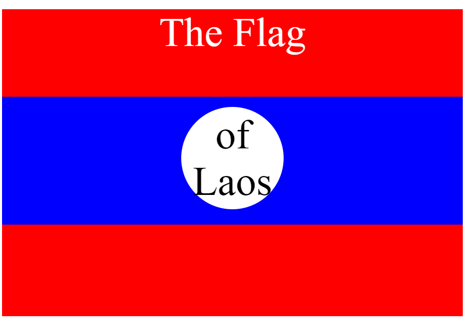

## Title: CSS Positioning

## Program by: John Rivero

## Date: June 28, 2024

## Task

-   The primary objective of this project is to design a website that visually represents the flag of Laos using CSS positioning techniques. The project aims to utilize advanced CSS properties to accurately recreate the flag's distinctive features, including its horizontal stripes and central white disc on a blue background. This endeavor will involve precise manipulation of CSS to ensure the correct alignment and proportions of the flag elements, showcasing the power and flexibility of CSS in creating intricate designs

## Result

-   Below is a screenshot of the result.

