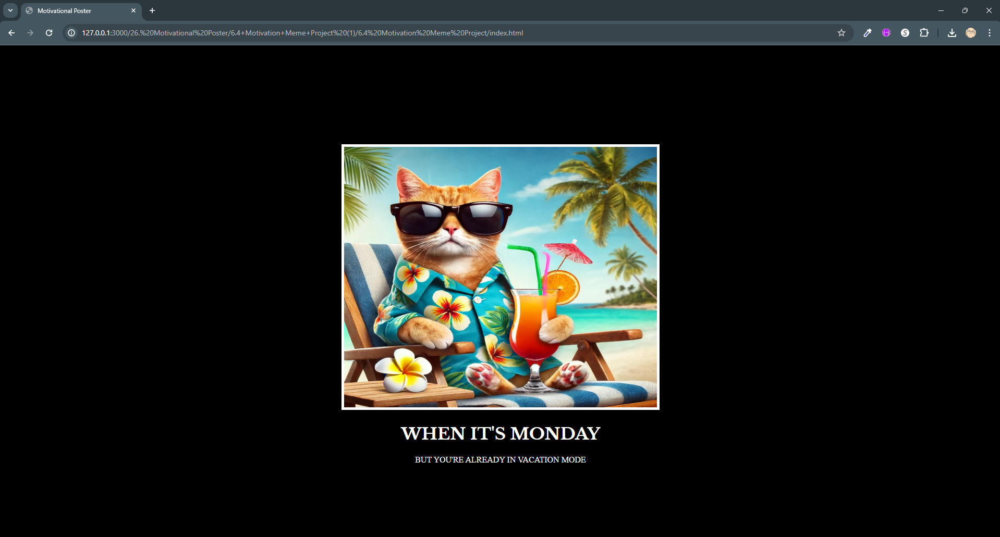

## Title: Meme Poster

## Program by: John Rivero

## Date: June 17, 2024

## Task

-   The primary objective of this project is to design and develop a meme poster by employing HTML 
 elements and CSS selectors. The task involves structuring the content using 
 tags to define different sections of the poster and applying CSS selectors to style these sections appropriately. This includes setting up the layout, fonts, colors, and other visual aspects to create a cohesive and visually appealing meme poster. The goal is to effectively use web development techniques to produce a humorous and engaging digital poster that can be easily shared online.

## Result

-   Below is a screenshot of the result.

