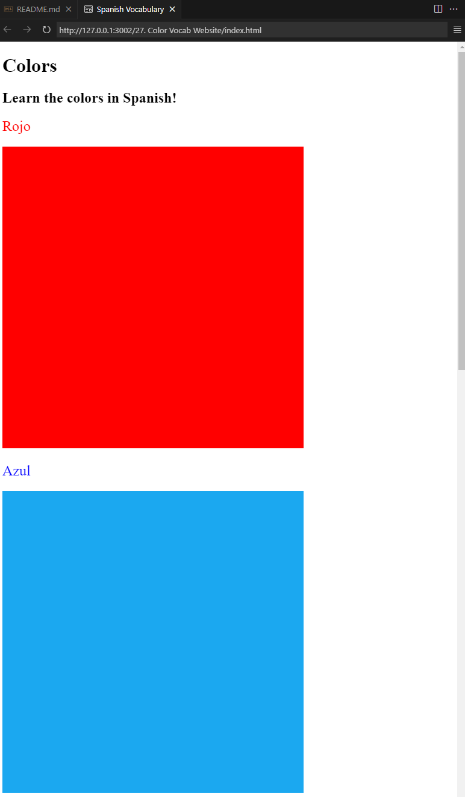

## Title: Color Vocab Website

## Program by: John Rivero

## Date: June 14, 2024

## Task

-   The primary objective of this project is to effectively utilize CSS to enhance the styling of the HTML file. This involves configuring various elements to improve their appearance, with a particular focus on adjusting the color of the texts and setting the size of the images. By leveraging CSS, we aim to achieve a visually appealing and cohesive design that enhances the overall user experience on the web page. This project will demonstrate how CSS can be applied to control and customize the presentation of HTML elements, ensuring that the text colors and image sizes are precisely tailored to meet the desired specifications.

## Code and Result

-   Below is a screenshot of the result.

