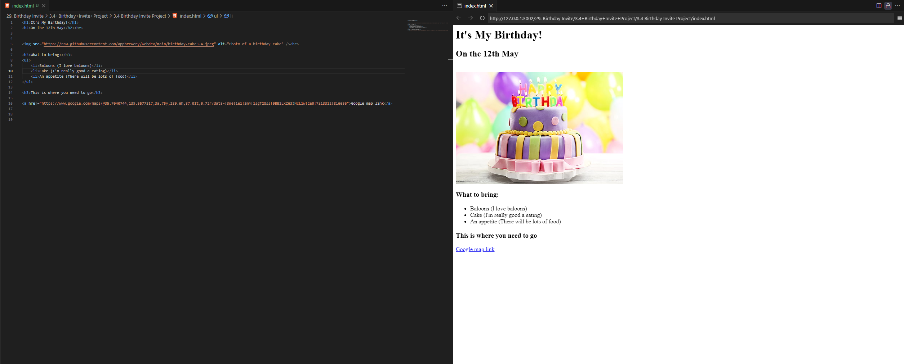

## Title: Birthday Invite

## Program by: John Rivero

## Date: June 12, 2024

## Task

-   The goal of this project is to design an interactive and visually appealing website that functions as a birthday invitation. The website will include elements such as an image related to the birthday event, for example, a picture of a cake, and a hyperlink to the Google Maps location of the event.

## Code and Result

-   Below is a screenshot of the code and the result.

